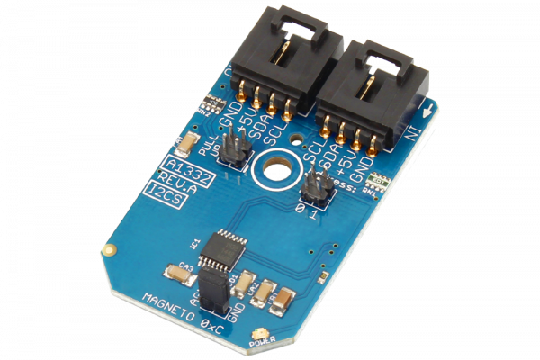

# Arduino_Library_A1332_Hall_Effect_Rotational_Angle_Sensor

#  A1332
A1332 is a Precision Hall Effect Rotational Angle 0° to 360° Sensor.
This Device is available from www.ncd.io [SKU:  A1332_I2CS]
(https://store.ncd.io/product/a1332-precision-hall-effect-rotational-angle-0-to-360-sensor-i2c-mini-module/)
This Sample code can be used with Arduino.

Hardware needed to interface Hall effect sensor with Arduino
1. <a href="https://store.ncd.io/product/i2c-shield-for-arduino-nano/">Arduino Nano</a>
2. <a href="https://store.ncd.io/product/i2c-shield-for-arduino-micro-with-i2c-expansion-port/">Arduino Micro</a>
3. <a href="https://store.ncd.io/product/i2c-shield-for-arduino-uno/">Arduino uno</a>
4. <a href="https://store.ncd.io/product/dual-i2c-shield-for-arduino-due-with-modular-communications-interface/">Arduino Due</a>
5. <a href="https://store.ncd.io/product/a1332-precision-hall-effect-rotational-angle-0-to-360-sensor-i2c-mini-module/">Hall Effect Sensor</a>

Download and install Arduino Software (IDE) on your machine. Steps to install Arduino are provided at:

https://www.arduino.cc/en/Main/Software

Download (or git pull) the code and double click the file to run the program.
Compile and upload the code on Arduino IDE and see the output on Serial Monitor.
